<div align="center">

# 🖥️ Resource Manager

**See every resource in your PC — and decide who actually gets it.**

[](LICENSE)
[](#-download)
[](https://github.com/BIOcanse/Resource-Manager/releases/latest)

**English** · [简体中文](README.zh-CN.md)

</div>

---

## 📖 What it is

Just as the name suggests, **Resource Manager** is a tool that tries to monitor and manage every resource on your computer: CPU compute, GPU compute, RAM, VRAM, and plenty of other resources you may or may not have thought about.

Start using Resource Manager and take real control of your PC! 🚀

> ⚠️ Hardware readings depend on the drivers and providers available on your system. GPU placement depends on application and driver support — not every running application can switch GPUs.

> 🌐 The interface language follows your system by default and can be set explicitly in Settings → Appearance → Interface language. Screenshots show the application with identifying details anonymized: device models, peripheral names, application names and personal paths use generic labels. Readings illustrate the interface, not benchmark results.

---

## 📊 Monitoring Console

The console helps you monitor a wide range of system data. As shown below, all the commonly used information is here, and you can freely adjust both the layout and which data is monitored.

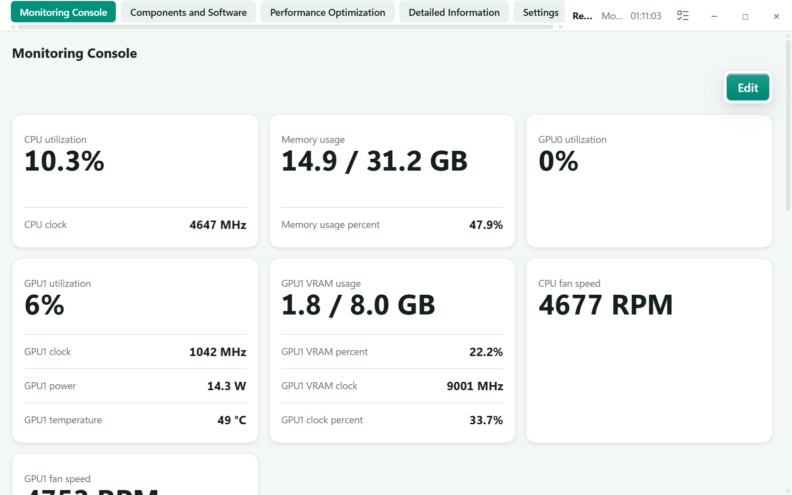

### 📈 Bar-chart overview

The lower half of the screenshot above uses bar charts so you can judge the state of your machine at a glance. Beyond the usual CPU, GPU, memory and VRAM views, you can also watch **virtual memory**. There are more monitoring items available here than the screenshot shows, and you can configure them freely.

### 🧮 Task-Manager-style view

This page is similar to the Windows Task Manager, except that you can inspect **many more monitoring items**. The layout and content follow Task Manager as closely as possible, and you can look at both application and process information — with lower overhead and smoother interaction.

It also fixes Task Manager's **double counting of shared memory**: the yellow part of each bar is the application's estimated share of shared memory. This is only meant to help you roughly analyze each application — nobody can divide shared memory between applications with perfect accuracy.

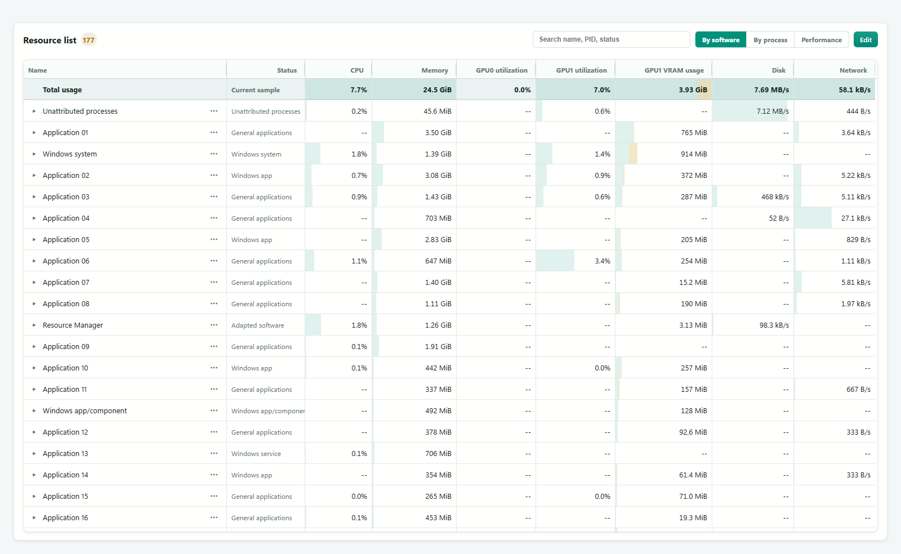

---

## 🧩 Components and Software

This page lists most of the software on your computer. If an application was not installed in the traditional way, you can add it manually by specifying its main executable and root directory so Resource Manager can bring it under management.

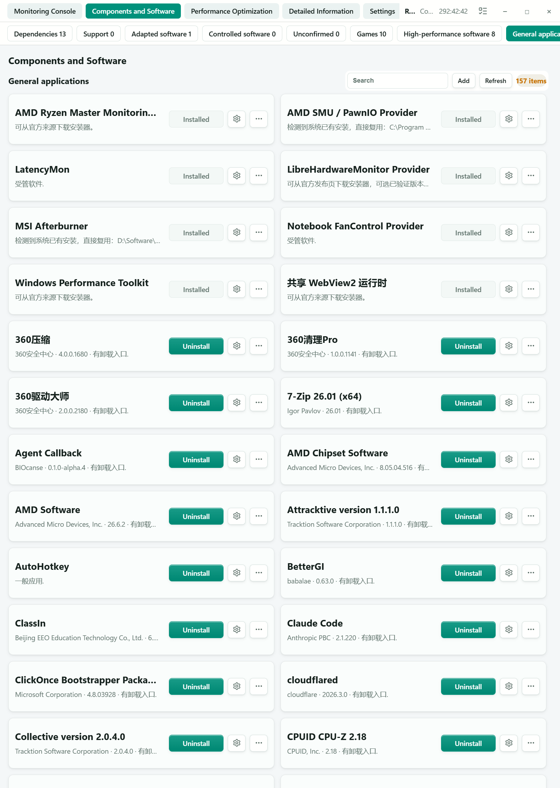

From here you can quickly:

- 📍 See where an application lives
- 📦 Migrate supported application data in one click (move it off `C:` to the drive the application is on, easing pressure on the system drive)
- ⚙️ Configure optimization settings

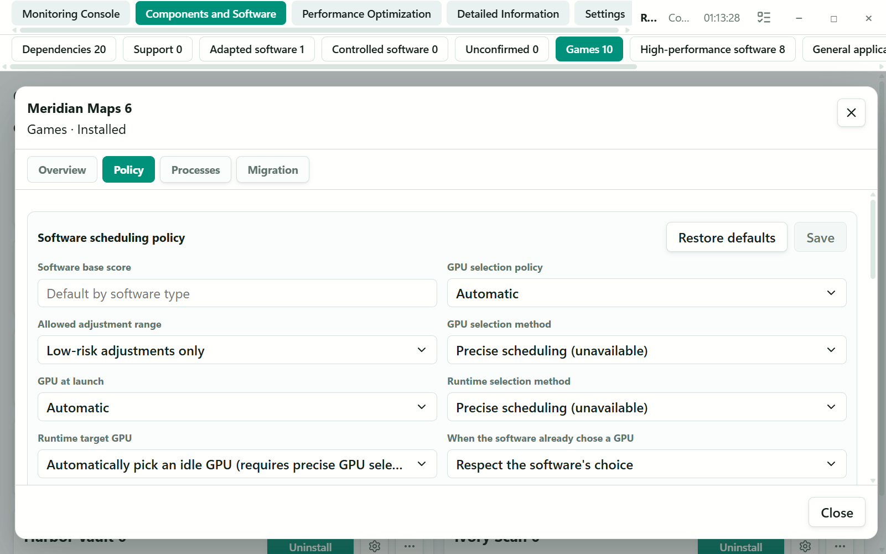

Every application can carry its own scheduling policy: its base score, how far the manager is allowed to adjust it, how the GPU is chosen at launch and at runtime, and whether an application's own GPU choice should be respected.

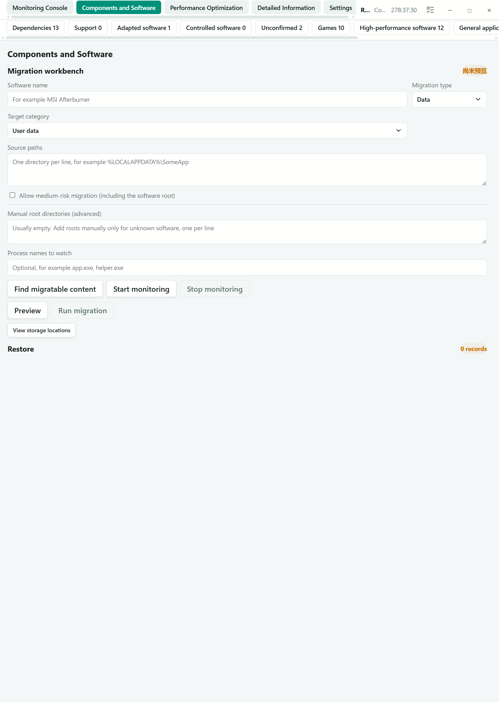

---

## ⚡ Performance Optimization

Choose **Normal**, or turn on **Memory**, **CPU**, and **GPU scheduling** independently. You can select any combination of the three; choosing Normal clears them all.

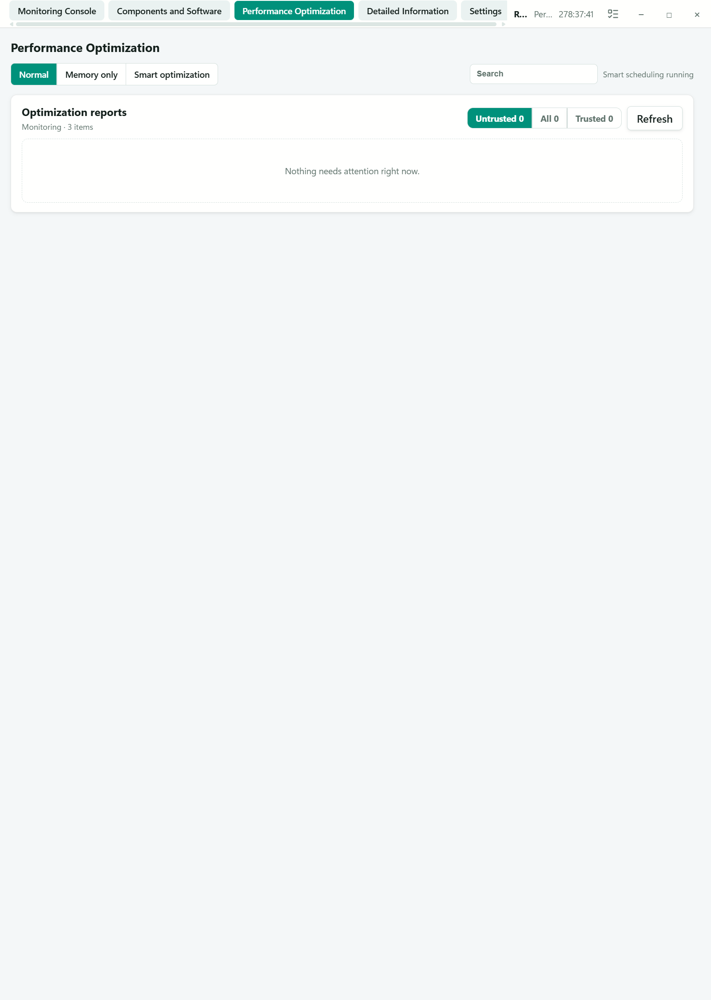

- **🧠 Memory scheduling** — manages RAM pressure without enabling CPU or GPU actions.
- **⚙️ CPU scheduling** — adjusts CPU policy and core placement.
- **⚡ GPU scheduling** — considers GPU load and VRAM pressure when placing supported renderers.

**VRAM and memory pressure.** GPU scheduling tracks GPU load and resident memory. When a lower-priority renderer has a verified runtime switching route, it can request a move to another GPU and check the next resident-memory sample. Unsupported renderers are not silently moved through a startup preference or an injected shim; even a supported move can leave some source-GPU residency.

**Multiple GPUs.** Per-application policies can select a launch GPU. Runtime moves are limited to renderer routes that pass their compatibility and cleanup checks; they are not general-purpose migration of every GPU-using application.

**Memory.** Selecting Memory scheduling enables ongoing RAM-pressure management. It can use CPU scores to order memory actions without enabling CPU actions.

**CPU.** When CPU scheduling is selected, cores are assigned intelligently: important applications get the less-contended or higher-performance cores first. You can also configure **exclusive core allocation** and **core locking** to help hold a stable frame rate.

> 💡 Worth noting: although Resource Manager uses highly optimized algorithms, scheduling still costs something. On CPUs with very weak multicore performance there may be no obvious CPU-side benefit — on a very early i3 or Ryzen 5, for example.

> 🧪 Runtime GPU switching currently uses an external controller without injecting a DLL into the target. A Chrome/ANGLE D3D11 route has been exercised with partial VRAM release; this does not verify native OpenGL switching. D3D12 and Vulkan have only been verified in a specific Qt fixture. This is not a claim of broad compatibility:
> - It is not applied to games or professional applications by default.
> - If another application has compatibility problems, turn scheduling off for that application.
> - Some motherboards and laptops disable the integrated GPU in discrete-GPU-direct mode. With only one available GPU, there is no cross-GPU move target; you can still enable GPU scheduling yourself.

### 📑 Optimization reports

Monitoring history is used to identify abnormal software, or software that is quietly stealing your PC's performance 🕵️:

- 💽 Abnormal disk writes
- 🌐 Unusually frequent network communication
- 📡 Excessive network traffic
- 🧠 Excessive memory usage
- 🔥 Excessive CPU usage
- ⚡ Frequent or long system interrupts
- …and other abnormal resource behavior

This helps you catch **memory leaks**, **misbehaving software**, **disk killers**, **problematic drivers**, and software that keeps talking to the network in the background.

> 📌 Abnormal network behavior points you at software worth investigating, but Resource Manager does not automatically decide that such communication is telemetry, nor infer what the transmitted data is for.

---

## 🎛️ Hardware Control

Balance performance, power and noise from one place. The control page brings together the CPU, GPU and fan adjustments available on your hardware, with live readings beside the controls so you can see the current state before changing it.

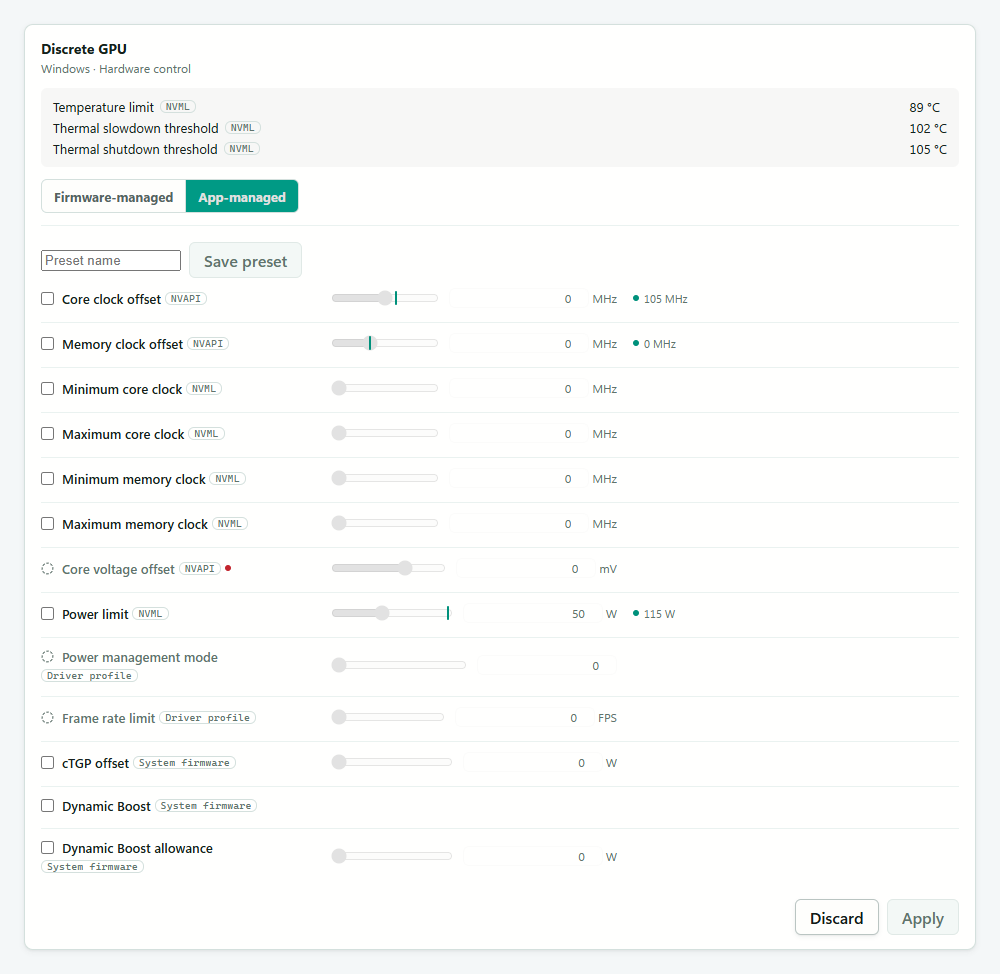

Each device has its own **Apply** and **Discard changes** buttons. Prepare several changes, apply just that device, or discard its draft without losing work on another card. Save settings as a profile to reuse them later. Controls that cannot be changed explain why when you hover over their icon; **Normal** and **Root** access levels distinguish ordinary adjustments from advanced controls.

### 🌡️ Fan curves

Choose the cooling response you want at each temperature. Drag a point or adjust it with the keyboard; neighboring points use **straight-line interpolation**, with a temperature and percentage grid for precise adjustments.

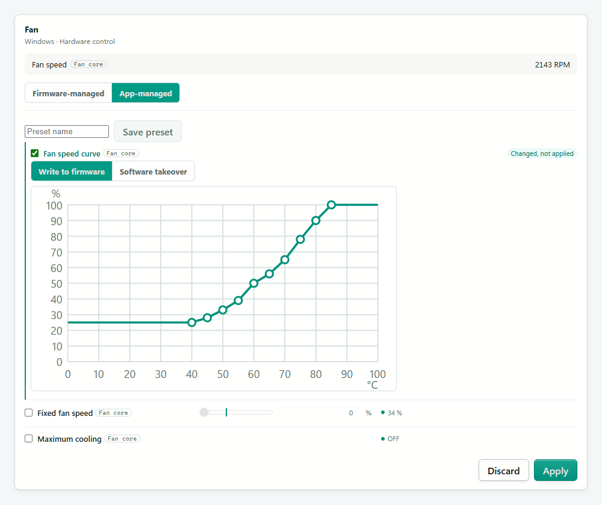

Where supported, choose between writing the curve to firmware and letting Resource Manager manage it in software. Editing stays in the card's draft until you apply it. You can also return a device to firmware control. Available settings, firmware curve steps and shared fan-control behavior depend on the hardware and driver.

---

## 🔌 Device Topology

Resource Manager displays every interface on the device — internal and external — along with its information and the devices connected to it.

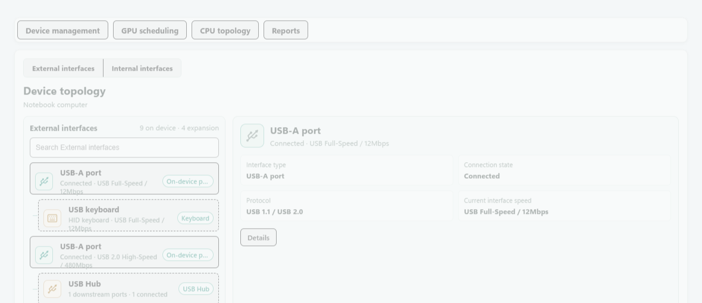

You can quickly check the **protocol that was actually negotiated**, which in many cases is the real limit on transfer speed.

---

## 🔬 Detailed Information

Detailed CPU and GPU monitoring, instead of a single utilization percentage that never tells you where the real bottleneck is.

**CPU topology**: per-core load laid out by CCD, cache level and physical core, with the processes using each logical processor.

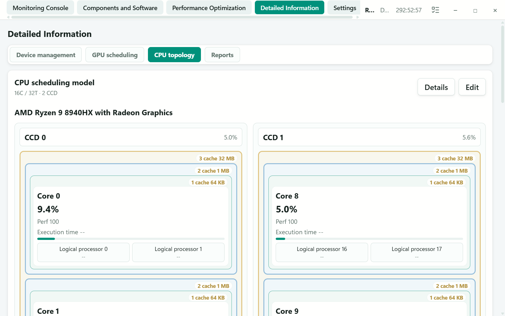

**GPU scheduling**: performance score, utilization, VRAM and clocks for each GPU, plus specialized-unit occupancy beyond rasterization (NVIDIA RT / CUDA / Tensor, AMD GCN / RDNA / CDNA — where the GPU and driver expose that counter).

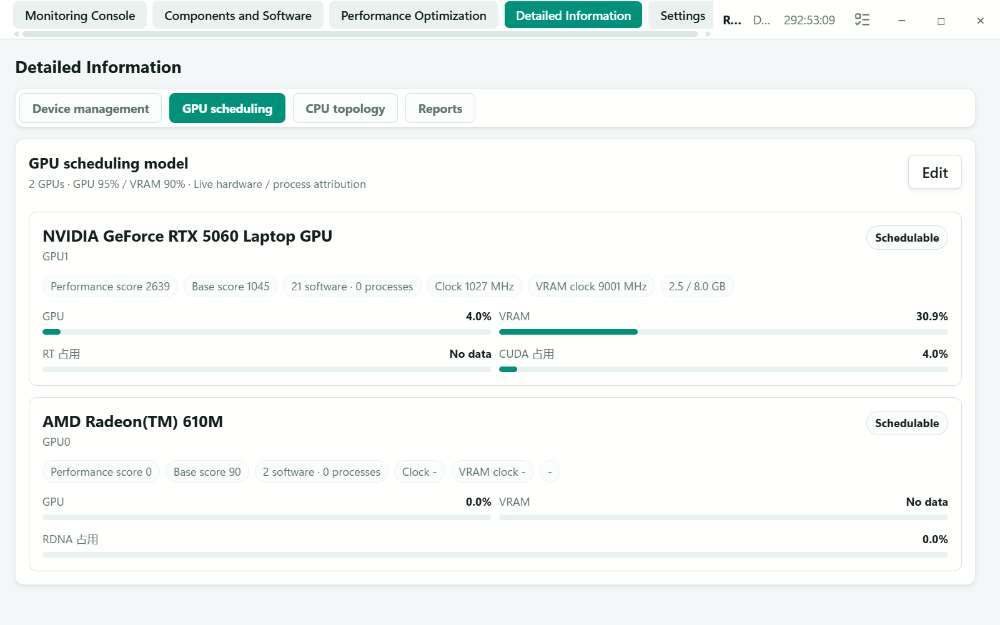

---

## ⚙️ Settings

Configure the scheduling policies you want.

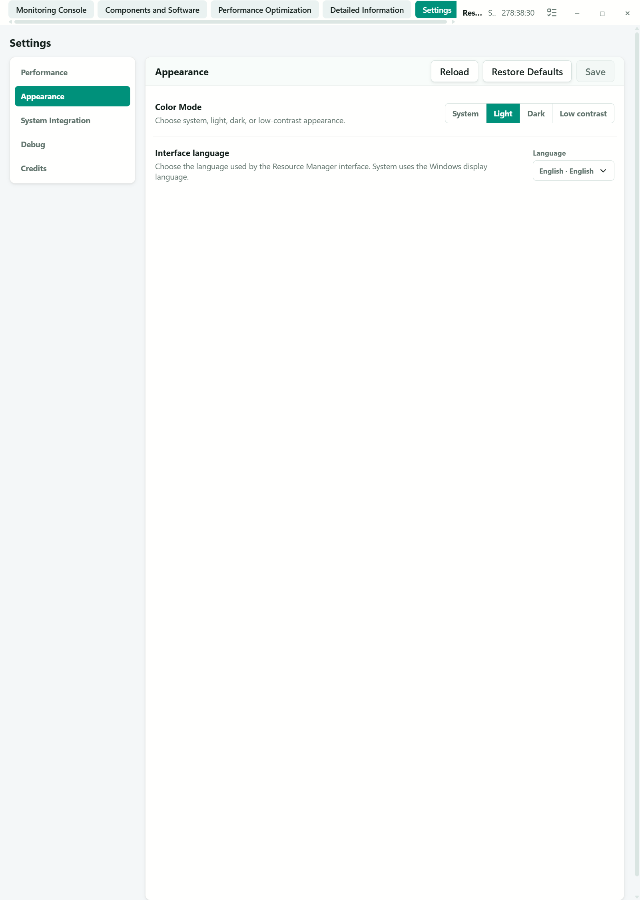

---

## 🧑‍💻 Developer API

Efficient resource management takes cooperation 🤝.

Local APIs and the adapter SDK let you connect your own monitoring and management tools. The developer API documentation is still being prepared.

---

## ⬇️ Download

Get the Windows x64 beta from GitHub Releases:

**[👉 Download the latest release](https://github.com/BIOcanse/Resource-Manager/releases/latest)**

### Requirements

- Windows 11 x64
- Microsoft Edge WebView2 Runtime

The release package includes the required .NET runtime. It uses your system's WebView2 runtime; if WebView2 is missing, the official Microsoft runtime is downloaded and installed automatically on first startup — an internet connection is only needed for that step.

---

## 📦 Installation

1. Download the latest Windows x64 release archive.
2. Extract the **complete folder** to a permanent location. For an update, extract it to a new folder outside the current installation.
3. Run `Install.cmd`. On an update it verifies the existing installation, backs up and replaces its program files, and preserves its configuration and data.
4. Run `Start.cmd` to start the service and the desktop interface.
5. Run `Restart.cmd` to restart the service when needed.

Service management requests administrator permission; the interface runs as a standard user.

Close the desktop interface before an update. Do not extract an update over a running installation. The installer preserves these directories in the existing installation:

```text
Config/
UserData/
Dependencies/
Misc/
```

---

## 📄 License and Acknowledgements

Resource Manager is licensed under the **[Apache License 2.0](LICENSE)**. Third-party components retain their own licenses.

This project would not be possible without the work of Microsoft, the .NET Foundation, and the many upstream authors and maintainers behind its dependencies. We are deeply grateful for their work 🙏. Full acknowledgements and license information are available in the application's Credits page and in the [Third-Party Notices](Resource%20Manager/Resource%20Manager-APP/ThirdPartyNotices/README.md).

---

## 🗂️ Repository

This project is maintained by the author. **External contributions and pull requests are not accepted.**

https://github.com/BIOcanse/Resource-Manager
