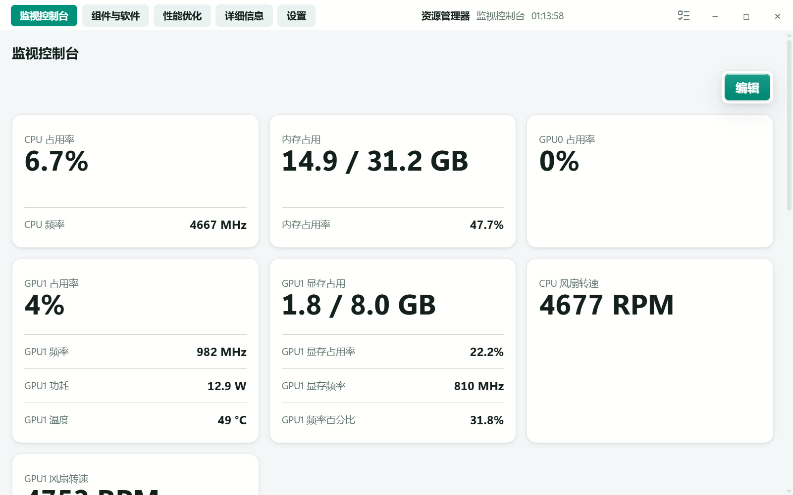
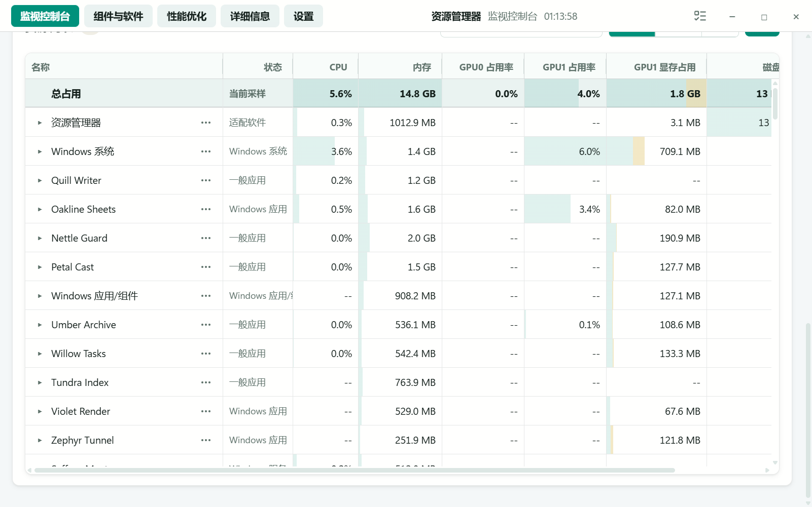
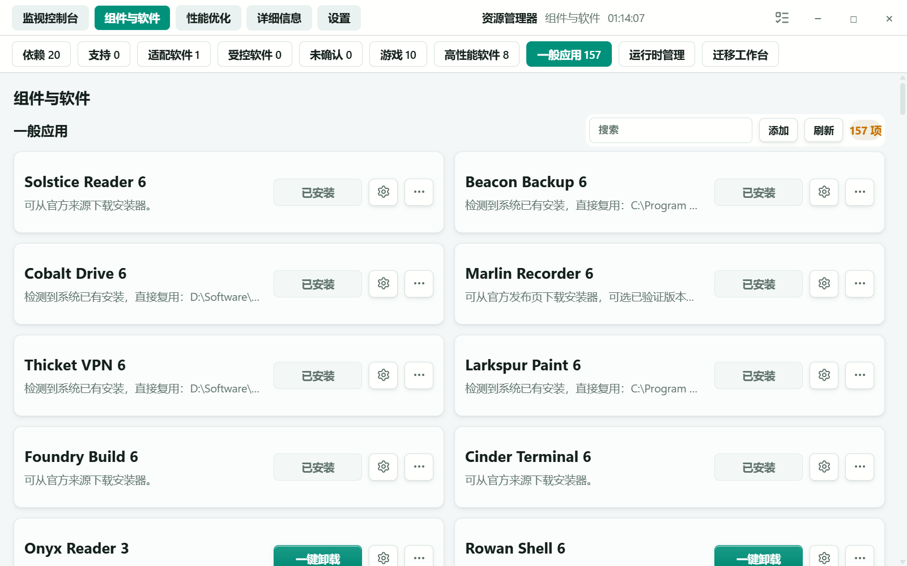
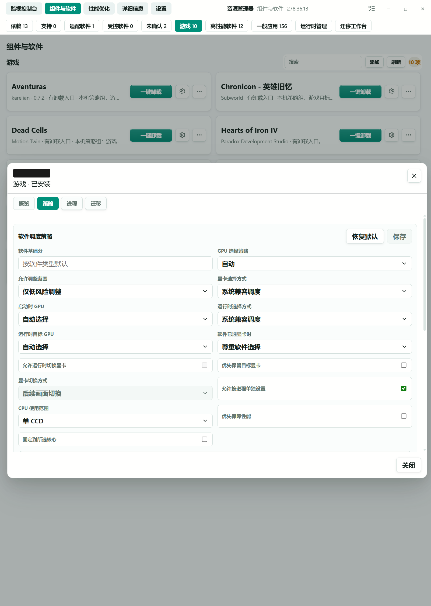
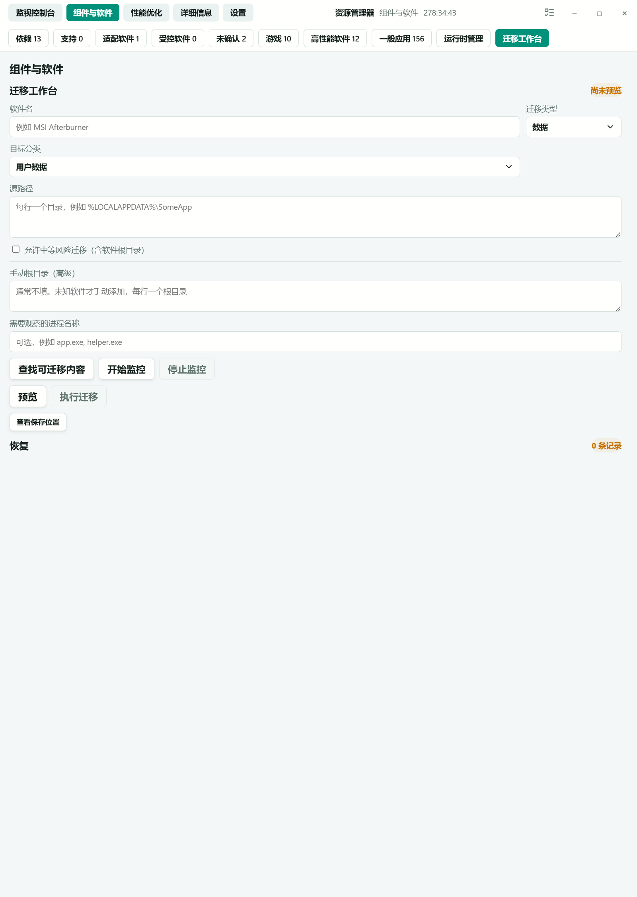
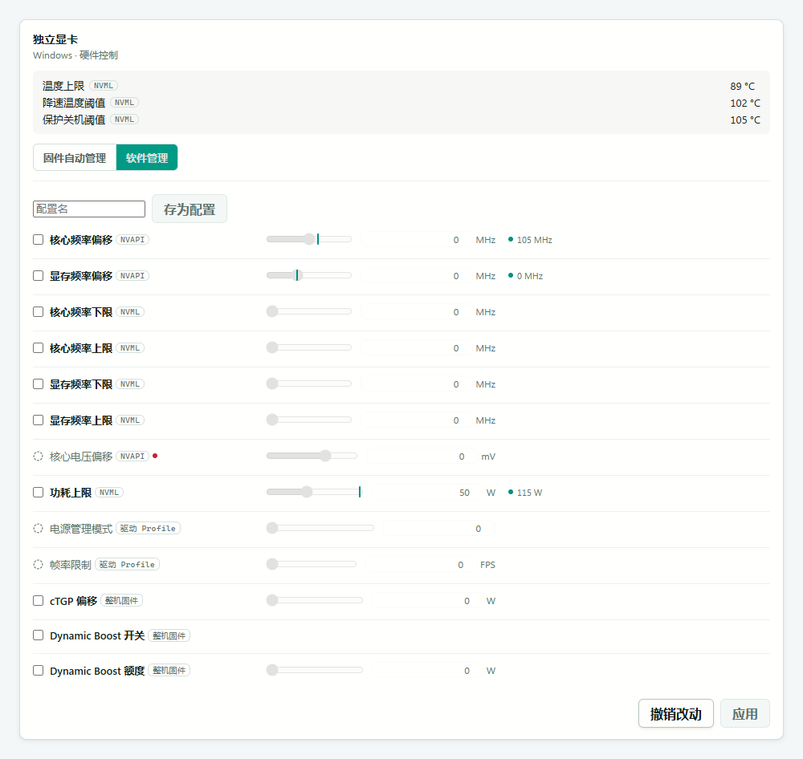
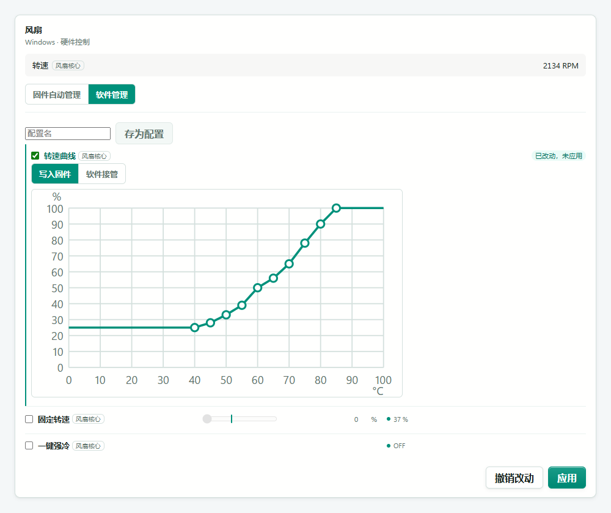
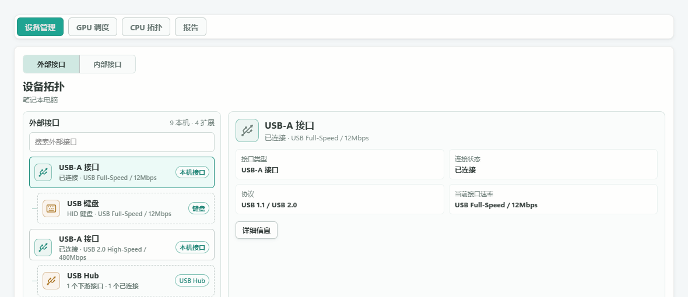
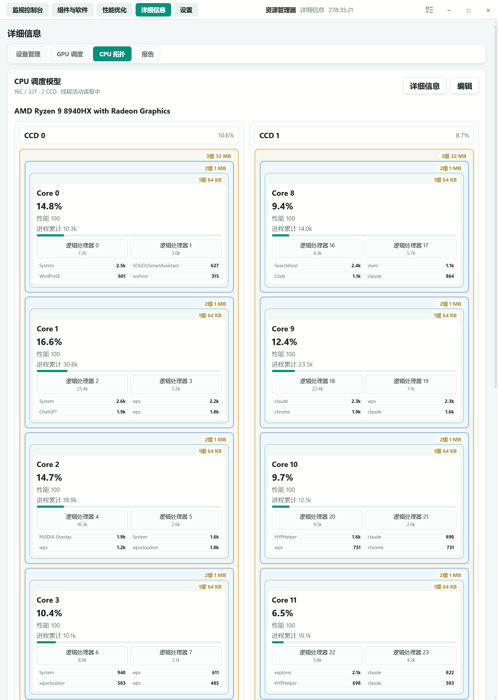
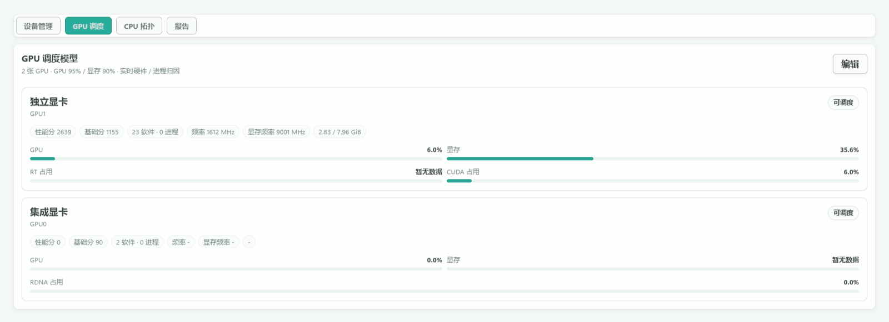

<div align="center">

# 🖥️ 资源管理器 / Resource Manager

**看清电脑的每一份资源，并真正决定它们该给谁。**

[](LICENSE)
[](#-下载)
[](https://github.com/BIOcanse/Resource-Manager/releases/latest)

[English](README.md) · **简体中文**

</div>

---

## 📖 这是什么

就像名字描述的那样，**资源管理器**是一个试图监视和管理电脑所有资源的软件：CPU 计算资源、GPU 计算资源、内存、显存，以及其他各种你能想到和没想到的资源。

从使用资源管理器开始，真正掌握你的电脑！🚀

> ⚠️ 硬件读数依赖于系统上可用的驱动与数据提供方；GPU 调度依赖软件和驱动的支持，并非每个运行中的程序都能切换显卡。

> 🌐 界面语言默认跟随系统，也可以在 设置 → 外观 → 界面语言 里手动指定。截图已脱敏：设备型号、外设名称、软件名称和个人路径使用通用名称代替。读数用于展示界面，不代表性能测试结果。

---

## 📊 监视控制台

帮助你监视电脑的各种数据。如图所示，所有常用的数据都在这里，你还可以自由调整排版以及监控的数据。



### 📈 条形图总览

上图下半部分使用条形图的方式帮助你快速判断电脑资源状态。除了常见的 CPU、GPU、内存、显存查看，你还可以查看**虚拟内存**。当然，这部分同样也有比图示更多的监控项供你自由配置。

### 🧮 类任务管理器视图

这部分是类似 Windows 系统任务管理器的页面，不过你可以在这里查看**更多的监控项**。布局和内容尽可能地复刻了任务管理器，你可以查看软件和进程的信息，并且拥有更低的性能占用和更高的流畅度。

而且它还解决了任务管理器的**共享内存重复计数**问题：条形图中黄色的部分是软件均摊的共享内存。不过这只是帮助你大概分析每个软件的情况 —— 没有人可能真正准确地划分共享内存的使用。



---

## 🧩 组件与软件

如图，这里你可以看到电脑上大部分的软件。如果是没有安装的软件，也可以指定主程序和根目录手动添加，以此将其纳入管理。



在这里你可以快速：

- 📍 查看软件位置
- 📦 一键迁移支持的软件数据（把数据从 `C:` 盘迁移到软件所在盘，减少系统盘压力）
- ⚙️ 配置优化设置



每个软件都可以单独设置调度策略：软件基础分、允许调整的范围、启动时与运行时的 GPU 选择方式，以及软件自己已经选好显卡时该不该尊重它的选择。



---

## ⚡ 性能优化

选择**普通模式**，或分别开启**内存调度**、**CPU 调度**和 **GPU 调度**。后三项可以任意组合；选择普通模式会清除其他选择。


- **🧠 内存调度** —— 管理内存压力，不会因此启用 CPU 或 GPU 动作。
- **⚙️ CPU 调度** —— 调整 CPU 策略与核心放置。
- **⚡ GPU 调度** —— 根据 GPU 负载和显存压力放置受支持的渲染进程。

**显存与内存压力。** GPU 调度会观察 GPU 负载和实际驻留显存。低优先级渲染进程只有具备已验证的运行时换卡路径时，才会请求移动到其他显卡，并在下一次驻留显存采样中检查效果。没有受支持路径的进程不会通过写入启动偏好或注入来假装完成运行时换卡；即使移动成功，来源显卡也可能保留部分占用。单显卡设备没有迁移目标时，会在内部跳过无目标规则，不提供额外开关。

**多显卡。** 可以为软件配置启动时使用的显卡。运行时移动只适用于通过兼容性和清理检查的渲染路径，不能保证任意使用 GPU 的软件都能移动。

**内存。** 选择内存调度后，系统会持续管理内存压力；它可以参考 CPU 分数决定内存动作的顺序，但不会因此执行 CPU 调度动作。

**CPU。** 选择 CPU 调度后，重要的软件会优先分配到负载更低或性能更强的核心；还可以配置**核心独占**和**核心锁定**，帮助维持稳定帧率。

> 💡 值得注意的是，本软件虽然使用了极其高性能的算法，但调度还是有性能损耗。CPU 多核性能过差的机器可能并没有明显的 CPU 效益提升（例如过早期的 i3、R5）。

> 🧪 运行时换卡采用不向目标注入 DLL 的外部控制路径。Chrome/ANGLE D3D11 路径已有部分显存释放的实测；D3D12 和 Vulkan 仅在特定 Qt 测试程序上验证过。这不代表对所有软件通用：
> - 默认对游戏和专业软件不启用该功能；
> - 如果其余软件出现兼容性问题，请自行关闭对该软件的调度；
> - 小部分主板 / 笔记本在独显直连的时候可能会关闭核显，如果此时你没有其他可用显卡，GPU 调度功能将不可用。

### 📑 优化报告

通过监控记录来识别异常软件，或者偷走你电脑性能的软件 🕵️：

- 💽 异常写盘
- 🌐 异常频次的网络通信
- 📡 异常的网络流量
- 🧠 过高的内存占用
- 🔥 过高的 CPU 占用
- ⚡ 频繁造成 / 造成长系统中断
- …以及其他异常资源行为

它可以帮你抓出**内存泄漏**、**流氓软件**、**磁盘杀手**、**问题驱动**，以及持续在后台通信的可疑软件。

> 📌 异常的网络行为可以帮你找出值得进一步调查的软件，但资源管理器不会自动判定这些通信就是遥测，也不会推断传输内容的用途。

---

## 🎛️ 硬件控制

把性能、功耗和噪声调到适合自己的平衡点。控制面集中展示当前硬件可用的 CPU、GPU 和风扇调节项，实时读数与调节控件放在一起，先看清现状，再决定怎么调。



每张设备卡片都有独立的**应用**和**撤销改动**。可以先修改多项设置，再只应用这一张卡；撤销时也不会丢掉其他卡片的草稿。常用设置可以存为配置，方便下次复用。不能调整的项目，把鼠标放到图标上即可查看原因；**普通**与 **Root** 两档权限区分日常调节和进阶控制。

### 🌡️ 风扇曲线

按温度设定你想要的散热响应。拖动控制点或用键盘微调，相邻点之间采用**直线插值**，配合温度、转速百分比和横竖网格，调整时有清晰的参照。



硬件支持时，可以选择写入固件，或交给资源管理器在软件中执行。编辑只改变草稿，点击本卡应用后才下发；也可以把设备交还固件管理。可调项目、固件曲线档位和多风扇联动行为取决于硬件与驱动。

---

## 🔌 设备拓扑

如图所示，软件会显示该设备上（外部和内部的）所有接口及其信息，并显示连接的设备。



你可以快速查看**实际协商的协议** —— 很多情况下，这才是真正限制传输速度的东西。

---

## 🔬 详细信息

CPU 和 GPU 的详细监控信息，而不是只能看到一个简单的占用率数字，却没法找到真正的瓶颈。

**CPU 拓扑**：按 CCD、缓存层级和物理核心展示分核负载，以及每个逻辑处理器上占用最多的进程。



**GPU 调度**：每张显卡的性能分、占用、显存、频率，以及光栅之外的专用单元占用（NVIDIA 的 RT / CUDA / Tensor，AMD 的 GCN / RDNA / CDNA，取决于显卡与驱动是否提供该计数器）。



---

## ⚙️ 设置

配置你需要的调度策略。


---

## 🧑‍💻 开发者 API

高效的管理需要协作 🤝。

本地 API 与适配 SDK 可以让你把自己的监控与管理工具接入资源管理器。开发者 API 文档仍在整理中。

---

## ⬇️ 下载

从 GitHub Releases 获取 Windows x64 测试版：

**[👉 下载最新版本](https://github.com/BIOcanse/Resource-Manager/releases/latest)**

### 系统要求

- Windows 11 x64
- Microsoft Edge WebView2 运行时

发布包内已包含所需的 .NET 运行时。WebView2 使用系统自带的运行时；如果系统缺少 WebView2，程序会在首次启动时自动下载并安装微软官方运行时 —— 只有这一步需要联网。

---

## 📦 安装

1. 下载最新的 Windows x64 发布包。
2. 将**整个文件夹**解压到固定位置。更新时请解压到现有安装目录之外的新文件夹。
3. 运行 `Install.cmd`。更新时安装器会核验原安装、备份并替换程序文件，保留配置和数据。
4. 运行 `Start.cmd` 启动服务与桌面界面。
5. 需要时运行 `Restart.cmd` 重启服务。

服务管理会请求管理员权限，界面本身以普通用户身份运行。

更新前请关闭桌面界面，不要将更新包直接覆盖正在运行的安装目录。安装器会保留原目录中的以下内容：

```text
Config/
UserData/
Dependencies/
Misc/
```

---

## 📄 许可与致谢

资源管理器基于 **[Apache License 2.0](LICENSE)** 授权，第三方组件仍适用各自的许可证。

没有 Microsoft、.NET Foundation 以及众多上游作者与维护者的工作，就没有这个项目，在此深表感谢 🙏。完整的致谢与许可信息见应用内的「致谢」页面，以及 [第三方声明](Resource%20Manager/Resource%20Manager-APP/ThirdPartyNotices/README.md)。

---

## 🗂️ 仓库

本项目由作者本人维护，**暂不接受外部贡献与 Pull Request**。

https://github.com/BIOcanse/Resource-Manager
